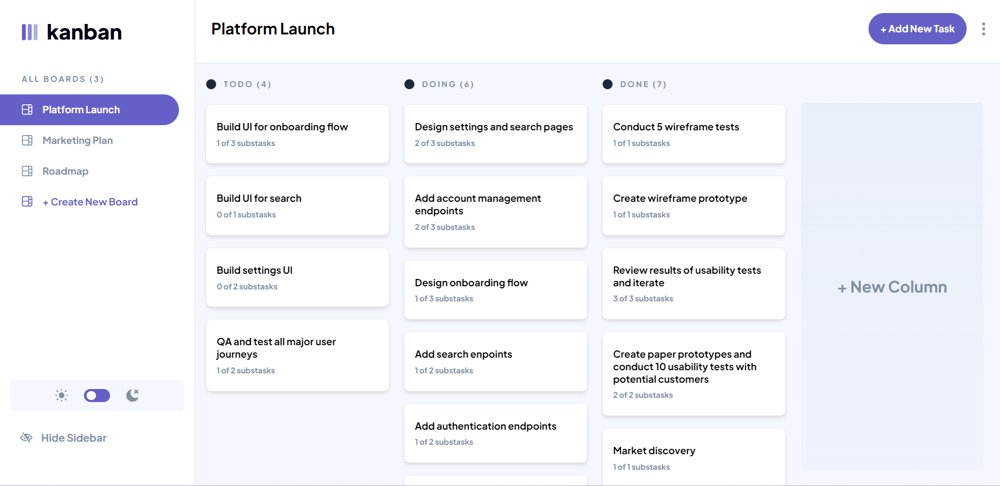

# Kanban task management web app

This is a solution to the [Kanban task management web app challenge on Frontend Mentor](https://www.frontendmentor.io/challenges/kanban-task-management-web-app-wgQLt-HlbB).

## Table of contents

- [Overview](#overview)
  - [The challenge](#the-challenge)
  - [Screenshot](#screenshot)
  - [Links](#links)
- [My process](#my-process)
  - [Built with](#built-with)
- [Author](#author)

## Overview

### The challenge

Users should be able to:

- View the optimal layout for the app depending on their device's screen size
- See hover states for all interactive elements on the page
- Create, read, update, and delete boards and tasks
- Receive form validations when trying to create/edit boards and tasks
- Mark subtasks as complete and move tasks between columns
- Hide/show the board sidebar
- Toggle the theme between light/dark modes
- Implement drag and drop functionality

### Screenshot

### Links

- Solution URL: [Kanban Task Management App with React, Redux and TailwindCSS](https://www.frontendmentor.io/solutions/kanban-task-management-app-with-react-redux-and-tailwindcss-6y6eya9ud4)
- Live Site URL: [Kanban Task Management Web App](https://kanban-mentor.netlify.app/)

## My process

### Built with

- Semantic HTML5 markup
- TailwindCSS
- Redux
- React
- Flexbox
- Mobile-first workflow
- [React](https://reactjs.org/) - JS library

## Author

- Website - [Alexander Guillén Hernández](https://alexanderguillen.netlify.app/)
- Frontend Mentor - [@AlexanderTheWise](https://www.frontendmentor.io/profile/AlexanderTheWise)
- [Linkedin](https://www.linkedin.com/in/alexander-gh)
